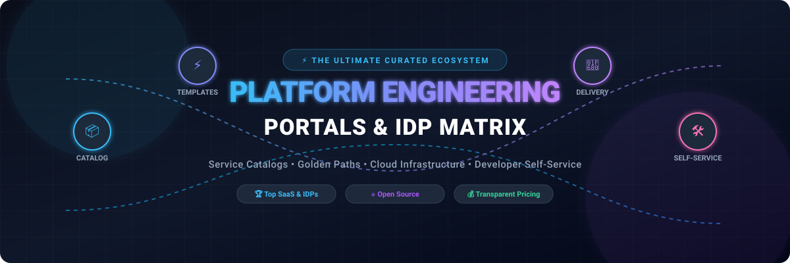

  

  
  
  
  
  
  
  
  

---

# 🚀 Awesome Platform Engineering Portal & IDP Matrix

> 🌐 A meticulously curated, SEO-indexed directory of **Top Platform Engineering Portals**, **Internal Developer Platforms (IDPs)**, **Service Catalogs**, **Golden Paths**, **Developer Self-Service Frameworks**, and **Cloud Delivery Platforms**.
> 
> 📅 **Last Updated:** September 2026

---

## 📑 Table of Contents

- [🌟 Overview](#-overview)
- [🏢 SaaS & Hosted Commercial Platforms](#-saas--hosted-commercial-platforms)
- [🛠️ Open-Source GitHub Projects](#️-open-source-github-projects)
- [🏗️ Architectural Blueprint for IDPs](#️-architectural-blueprint-for-idps)
- [🤝 How to Contribute](#-how-to-contribute)
- [📈 Star History](#-star-history)
- [⚠️ Disclaimer](#️-disclaimer)

---

## 🌟 Overview

Modern software engineering organizations rely on **Internal Developer Portals (IDPs)** and **Platform Engineering ecosystems** to eliminate cognitive overload, reduce developer friction, standardize governance, and accelerate software delivery. 

Key pillars of modern developer platforms include:
- **🗂️ Centralized Software & Service Catalogs:** Unified inventory of microservices, APIs, cloud resources, dependencies, and ownership data.
- **✨ Golden Paths & Scaffolding Templates:** Production-ready boilerplates enforcing architectural best practices, security guardrails, and compliance.
- **⚡ Developer Self-Service:** Automated on-demand provisioning for environments, ephemeral clusters, databases, and CI/CD deployment pipelines.
- **📊 Scorecards & Engineering Standards:** Gamified reliability metrics, DORA measurements, tech debt scoring, and security posture monitoring.

---

## 🏢 SaaS & Hosted Commercial Platforms

> 💡 **Market Size & Sector Concentration:** The global Internal Developer Platform (IDP) and Platform Engineering market is estimated at **$5.5B – $10.2B (2026–2030)** growing at a CAGR of **~24%–28%**. The sector is currently **moderately fragmented**, transitioning from specialized point solutions (software catalogs, scorecards, infra provisioners) toward consolidated platforms led by enterprise DevOps giants (Atlassian, Red Hat/IBM, Spotify, Harness) alongside fast-growing pure-play IDP specialists (Port, Cortex, Humanitec).

*The SaaS table below is sorted in descending order by company scale (Valuation / Market Capitalization / Funding / Annual Revenue).*

| Product | Description | Company Size (Valuation / Revenue / Funding) | Pricing (Starting Tier) | Free Tier / Free Trial Limits |
| :--- | :--- | :--- | :--- | :--- |
| **Spotify Portal** | Commercial Backstage-oriented developer portal suite with enterprise plugins (Soundcheck, Insights, Skill Exchange, RBAC). | **~$60B+ Market Cap** ($15B+ Ann. Rev; NYSE: SPOT) | **Enterprise Tier:** Starting at ~$20–$35/developer/month (annual contract via AWS Marketplace) | **30-day evaluation trial** & demo environment upon private offer request |
| **Atlassian Compass** | Developer experience platform and component catalog providing microservice ownership, scorecards, and deployment tracking. | **~$45B+ Market Cap** ($4.4B+ Ann. Rev; NASDAQ: TEAM) | **Standard Plan:** $8/user/month (Premium tier at $25/user/month) | **Free forever** for up to 3 full users (unlimited basic users) & up to 10,000 catalog components |
| **Red Hat Developer Hub** | Enterprise-grade Backstage distribution offering pre-integrated plugins, RBAC, and certified dynamic plugins. | **~$34B Acquisition Scale** ($4B+ Ann. Rev; IBM) | **Enterprise Subscription:** Starting at ~$1,500/year (or via Red Hat OpenShift Platform Plus) | **60-day product trial** (self-supported via Customer Portal) or **30-day Developer Sandbox** access |
| **Harness IDP** | Enterprise developer portal module unified with the Harness continuous delivery, feature flags, and chaos engineering platform. | **$3.7B Valuation** ($100M+ ARR, $425M+ Total Funding) | **Developer 360:** Starting at ~$25–$40/developer/month (or Harness Flex subscription units) | **14-day free trial** with access to core platform modules upon signup |
| **Cortex** | Internal developer portal focused on service catalogs, ownership standards, DORA metrics, integrations, and scorecards. | **~$500M+ Valuation** ($53M+ Total Funding / Series B) | **Standard Tier:** Starting at ~$30–$50/developer/month (~$30,000/year minimum contract) | **14 to 30 days free trial** / proof-of-concept environment upon demo request |
| **Port** | Commercial no-code developer portal for building flexible software catalogs, dashboards, scorecards, and self-service actions. | **~$300M+ Valuation** ($53M+ Total Funding / Series B) | **Basic Plan:** $30/seat/month billed annually (Standard tier at $40/seat/month) | **Free forever** for up to 15 seats and 10,000 catalog entities (full features, no credit card required) |
| **Platform.sh (Upsun)** | Cloud application platform providing automated container environments, GitOps branching, and infrastructure orchestration. | **$180M+ Total Funding** ($50M+ ARR) | **Base Tier:** Starting from $10/user/month + $9/project/month ($19/month first-project credit offset provided) | **15-day free trial** (1 org, 1 project, 2 running environments, up to 4.5 CPUs, 12 GB RAM, 20 GB storage, no CC required) |
| **Akuity** | Managed enterprise GitOps and application delivery platform built by the creators of Argo (Argo CD, Workflows, Rollouts). | **~$100M+ Valuation** ($40M+ Total Funding) | **Pro Plan:** $495/month (includes 1 Argo CD + 1 Kargo control plane, 50 apps, 50 stages, 25M AI tokens) | **14-day free trial** of Pro tier; **6 months free** for qualified early-stage startups |
| **Humanitec** | Platform engineering platform centering on workload specifications (Score) and dynamic infrastructure orchestration. | **~$80M–$100M Valuation** ($35M+ Total Funding) | **Teams Plan:** $1,979/month (includes 5 users, 1 project with up to 5 environments, email support) | **14-day free trial** & interactive 10-minute sandbox environment (no credit card required) |
| **Humanitec Portal** | Developer portal interface complementing Humanitec Platform Orchestrator with service catalogs and self-service actions. | **~$80M–$100M Valuation** (Part of Humanitec suite) | **Teams Plan:** $1,979/month (bundled with Orchestrator; Pro tier at $4,950/month) | **14-day free trial** with access to portal components & demo sandbox |
| **Mia-Platform** | Composable enterprise developer platform for microservice orchestration, API management, and fast cloud-native development. | **~$40M+ Ann. Revenue** (€35M+ ARR, Enterprise Growth) | **Standard Plan:** Starting at ~$5,000/month (~$60,000/year base enterprise license) | **14 to 30 days free trial** / guided proof-of-concept upon scheduling a consultation |
| **Northflank** | Cloud-native developer platform combining full stack builds, microservices, managed databases, networking, and self-service UI. | **$25M+ Total Funding** (Series A stage) | **Pay-As-You-Go Compute:** Starting from $2.70/month ($0.01667/vCPU-hr, $0.00833/GB-hr RAM; $0 per-seat fee) | **Free forever** Sandbox tier with 2 services, 1 database, 2 cron jobs, and always-on compute |
| **Northflank Developer Platform** | Application delivery platform providing developer-facing abstractions over Kubernetes clusters and multi-cloud operations. | **$25M+ Total Funding** (Series A stage) | **Micro Tier:** Starting at $2.70/month per micro instance ($0.01667/vCPU-hr; $0 per-seat charges) | **Free forever** Sandbox plan with 2 services, 1 managed database, and 2 cron jobs |
| **OpsLevel** | Developer portal and service catalog platform focused on microservice ownership, automated scorecards, and maturity metrics. | **$20M+ Total Funding** ($15M Series A) | **Teams Tier:** Starting at ~$350–$600/developer/year (~$29–$50/dev/month; typical min. contract ~$15k/year) | **14 to 30 days free trial** / guided proof-of-concept with interactive demo sandbox upon request |
| **Qovery** | Developer platform combining Kubernetes abstraction, ephemeral environment generation, and infrastructure self-service. | **$15M+ Total Funding** ($12M Series A) | **Team Plan:** Usage-based compute billing starting with base resources + $0.016/deployment min overage | **14-day free trial** including 10 users, 100 environments, and 5,000 deployment minutes (no credit card required) |
| **StackGen** | AI-driven infrastructure and platform engineering platform generating reproducible IAC and self-service developer workflows. | **$12M+ Total Funding** ($10M Seed / Series A) | **Starter Edition:** $1,200/year (~$100/month for up to 5 developers via AWS Marketplace) | **Free forever** Developer Edition for 1 user per organization |
| **Cycloid** | Internal developer portal and platform combining framework automation, GitOps workflows, and FinOps/GreenOps governance. | **$10M+ Total Funding** (€8M+ ARR) | **Starter Plan:** €29/user/month (~$29/user/month, billed annually) | **14-day free trial** / guided demo evaluation available upon request |
| **Configure 8** | Internal developer portal focused on universal service catalogs, cloud asset tracking, scorecards, and developer productivity. | **$10M+ Total Funding** (Seed / Series A) | **Teams Plan:** $24/developer/month (billed for active SCM contributors; non-coding users free) | **Free forever** for small teams & non-profits; **14-day free trial** for standard organizations |
| **Massdriver** | Visual platform engineering and cloud architecture tool that packages infrastructure patterns into self-service modules. | **$10M+ Total Funding** ($8M Seed) | **Business Plan:** $30/seat/month (or base platform tier from $500/month) | **14-day free trial** of Business plan (no CC required) + 1-month free self-hosted evaluation license |
| **Facets.cloud** | Developer platform providing cloud infrastructure provisioning, blueprint orchestration, and multi-tenant environment management. | **$8M+ Total Funding** (Seed / Series A) | **SaaS Plan:** $799/month (includes 20 Resource Instances; additional RIs at $10/RI/month) | **14-day free trial** with starter quota included (no credit card required) |
| **Appvia** | Cloud and platform engineering platform providing developer self-service, Wayfinder Kubernetes governance, and cloud automation. | **$7.5M+ Total Funding** (MMC Ventures) | **Wayfinder Standard:** Starting at £120/cluster/year (~$150/cluster/year) or ~$25/dev/month | **Free forever** "Free to Start" tier for the first cluster with self-service workspaces and no end date |
| **Roadie** | Managed SaaS Backstage solution delivering automated updates, hosted TechDocs, and curated plugin catalog integrations. | **$5.5M+ Total Funding** (Y Combinator W21) | **Teams Plan:** $24/developer/month (billed for active contributing developers; viewers free) | **14-day free trial**; **Roadie Local** is free forever for teams with up to 15 users |
| **Encore** | Backend development engine and platform combining declarative architecture, type-safe infrastructure, and automated DevOps. | **$5M+ Total Funding** (Seed stage) | **Pro Plan:** $39/member/month (plus $99/cloud environment for dedicated AWS/GCP automation) | **Free forever** with unlimited team members, 100,000 req/day, 1 GB DB storage, 1 GB object storage, 100k msgs/day |
| **Rely.io** | AI-native internal developer portal offering automated software catalogs, DORA insights, scorecard tracking, and developer UX. | **$5M+ Total Funding** (Seed stage) | **Standard Plan:** Starting at $25/user/month | **14-day free trial** with instant sandbox onboarding and interactive demo environments |
| **Flightdeck** | Managed Backstage portal offering hosted plugins, SSO integrations, and reduced infrastructure overhead for engineering teams. | **<$5M Early Stage** (Seed / Angel) | **Managed Plan:** Starting at $20/developer/month (approx. $500/month minimum base) | **14-day free trial** / evaluation sandbox access on signup |
| **Kraken** | Platform engineering and continuous software delivery ecosystem for automated pipeline execution and developer workflows. | **<$5M Open-Core / Early Stage** | **Cloud Tier:** Starting at $20/user/month for managed cloud instances | **Free forever** for self-hosted Community Edition; **14-day free trial** for cloud-hosted environments |

---

## 🛠️ Open-Source GitHub Projects

> 🌟 *Open-source tools form the composable building blocks of modern platform engineering. Below is the complete ranked collection of leading open-source internal developer portals, orchestrators, GitOps tools, and developer platforms, sorted in **descending order by GitHub Stars**.*

| Rank | Project & Repository | Star Badge (Link to Stargazers) | Category | Description |
| :---: | :--- | :--- | :--- | :--- |
| **1** | [**Kubernetes**](https://github.com/kubernetes/kubernetes) |  | 🚢 Runtime & Orchestration | Foundational container orchestration platform powering the execution layer of modern internal developer platforms. |
| **2** | [**Grafana**](https://github.com/grafana/grafana) |  | 📊 Observability & Dashboards | The leading open-source telemetry visualization and observability dashboard platform embedded in developer portals. |
| **3** | [**Prometheus**](https://github.com/prometheus/prometheus) |  | 📈 Monitoring & Telemetry | Cloud Native Computing Foundation (CNCF) monitoring and time-series metrics system for platform service health. |
| **4** | [**Docusaurus**](https://github.com/facebook/docusaurus) |  | 📚 Docs-as-Code | Modern static documentation website generator frequently paired with developer portals for technical knowledge bases. |
| **5** | [**Terraform**](https://github.com/hashicorp/terraform) |  | 🏗️ Infrastructure-as-Code | Declarative infrastructure automation tool providing the foundational provisioning layer for developer self-service. |
| **6** | [**Portainer**](https://github.com/portainer/portainer) |  | 🖥️ Container Management | Open-source container and Kubernetes management UI providing intuitive developer self-service operational dashboards. |
| **7** | [**Backstage**](https://github.com/backstage/backstage) |  | 🏛️ Internal Developer Portal | CNCF Incubating open-source framework created by Spotify for building centralized developer portals, software catalogs, and TechDocs. |
| **8** | [**Swagger UI**](https://github.com/swagger-api/swagger-ui) |  | 🔌 API Documentation | Visual rendering interface for OpenAPI definitions, enabling seamless interactive API exploration inside developer portals. |
| **9** | [**Loki**](https://github.com/grafana/loki) |  | 📜 Log Aggregation | Horizontally scalable, multi-tenant log aggregation system optimized for Kubernetes platform engineering stacks. |
| **10** | [**Jenkins**](https://github.com/jenkinsci/jenkins) |  | 🔄 CI/CD Automation | Mature extensible automation server powering enterprise pipeline orchestration and self-service deployment actions. |
| **11** | [**OpenTofu**](https://github.com/opentofu/opentofu) |  | 🏗️ Infrastructure-as-Code | Open-source, community-driven fork of Terraform governed by the Linux Foundation for transparent infrastructure provisioning. |
| **12** | [**Cookiecutter**](https://github.com/cookiecutter/cookiecutter) |  | ⚡ Scaffolding & Templates | Command-line utility that creates projects from project templates, empowering automated golden paths. |
| **13** | [**Rancher**](https://github.com/rancher/rancher) |  | 🌐 Multi-Cluster Kubernetes | Complete software stack for teams adopting containers and managing multi-cluster Kubernetes operations at scale. |
| **14** | [**OpenAPI Generator**](https://github.com/OpenAPITools/openapi-generator) |  | 🔌 API Tooling & SDKs | Code generator for API client libraries, server stubs, and documentation directly from OpenAPI specs. |
| **15** | [**Pulumi**](https://github.com/pulumi/pulumi) |  | 🏗️ Infrastructure-as-Code | Infrastructure-as-code platform supporting TypeScript, Python, Go, C#, and Java for programmatic cloud provisioning. |
| **16** | [**JHipster**](https://github.com/jhipster/generator-jhipster) |  | ⚡ Application Scaffolding | Application generator platform used by platform teams to scaffold full-stack microservice architectures and golden paths. |
| **17** | [**OpenTelemetry Collector**](https://github.com/open-telemetry/opentelemetry-collector) |  | 📡 Observability Framework | Vendor-agnostic proxy that receives, processes, and exports telemetry data across platform engineering ecosystems. |
| **18** | [**MkDocs**](https://github.com/mkdocs/mkdocs) |  | 📚 Technical Documentation | Fast, simple static site generator that powers Backstage TechDocs and developer documentation repositories. |
| **19** | [**Jaeger**](https://github.com/jaegertracing/jaeger) |  | 🔍 Distributed Tracing | CNCF graduate distributed tracing platform for monitoring and troubleshooting transactions in microservice architectures. |
| **20** | [**Argo CD**](https://github.com/argoproj/argo-cd) |  | 🔄 GitOps Delivery | Declarative GitOps continuous delivery tool for Kubernetes that executes deployments triggered via developer self-service. |
| **21** | [**Skaffold**](https://github.com/GoogleContainerTools/skaffold) |  | 💻 Developer Environment | Google-created CLI tool facilitating continuous development and iterative deployment for Kubernetes applications. |
| **22** | [**Argo Workflows**](https://github.com/argoproj/argo-workflows) |  | ⚙️ Workflow Engine | Container-native workflow engine orchestrating parallel jobs and self-service automation pipelines on Kubernetes. |
| **23** | [**Earthly**](https://github.com/earthly/earthly) |  | 🔨 Build Automation | Reproducible build automation tool combining the best of Dockerfiles and Makefiles for standardized CI/CD pipelines. |
| **24** | [**Dagger**](https://github.com/dagger/dagger) |  | 🚀 Programmable CI/CD | Programmable CI/CD engine running pipelines in containers with native SDKs in Go, Python, TypeScript, and GraphQL. |
| **25** | [**Crossplane**](https://github.com/crossplane/crossplane) |  | ☁️ Universal Control Plane | CNCF framework transforming Kubernetes into a universal control plane to expose customized cloud infrastructure APIs. |
| **26** | [**Open Policy Agent (OPA)**](https://github.com/open-policy-agent/opa) |  | 🛡️ Policy-as-Code | General-purpose policy engine enabling unified, context-aware policy enforcement across microservices and self-service portals. |
| **27** | [**DataHub**](https://github.com/datahub-project/datahub) |  | 🗃️ Data Catalog & Metadata | LinkedIn's open-source metadata platform extending catalog capabilities to data products, pipelines, and datasets. |
| **28** | [**Yeoman**](https://github.com/yeoman/yo) |  | ⚡ Scaffolding Ecosystem | Scaffolding ecosystem offering community generators to kickstart standardized microservices and web applications. |
| **29** | [**Tilt**](https://github.com/tilt-dev/tilt) |  | 💻 Local Kubernetes Dev | Microservice local development environment managing live updates, container builds, and real-time logs. |
| **30** | [**Spinnaker**](https://github.com/spinnaker/spinnaker) |  | 🔄 Multi-Cloud CD | Multi-cloud continuous delivery platform created by Netflix for fast, safe, automated software deployments. |
| **31** | [**Tekton Pipelines**](https://github.com/tektoncd/pipeline) |  | ⚙️ Kubernetes CI/CD | Kubernetes-native framework for declaring CI/CD building blocks and execution pipelines across cloud providers. |
| **32** | [**Flux CD**](https://github.com/fluxcd/flux2) |  | 🔄 GitOps Reconciliation | Open and extensible continuous delivery solution for Kubernetes built on GitOps principles and CNCF standards. |
| **33** | [**DevLake**](https://github.com/apache/incubator-devlake) |  | 📈 Engineering Intelligence | Apache open-source dev data platform that integrates, analyzes, and visualizes DevOps toolchain and DORA metrics. |
| **34** | [**OpenMetadata**](https://github.com/open-metadata/OpenMetadata) |  | 🗃️ Unified Metadata Catalog | Open standard for metadata management, data governance, service ownership, and data catalog integration. |
| **35** | [**KubeVela**](https://github.com/kubevela/kubevela) |  | 📦 Application Delivery | CNCF application delivery platform providing developers with application-centric abstractions over raw Kubernetes. |
| **36** | [**vCluster**](https://github.com/loft-sh/vcluster) |  | 🧪 Ephemeral Environments | Virtual Kubernetes cluster technology enabling secure multi-tenancy and ephemeral test/preview environments. |
| **37** | [**Kyverno**](https://github.com/kyverno/kyverno) |  | 🛡️ Kubernetes Governance | Kubernetes-native policy management engine for validating, mutating, and generating configurations without learning Rego. |
| **38** | [**Garden**](https://github.com/garden-io/garden) |  | 🧪 Environment Orchestration | Development orchestrator for Kubernetes accelerating testing, ephemeral environment creation, and remote builds. |
| **39** | [**DevSpace**](https://github.com/loft-sh/devspace) |  | 💻 Cloud-Native Dev CLI | Fast developer CLI tool for building, deploying, and debugging applications directly inside Kubernetes clusters. |
| **40** | [**Keptn**](https://github.com/keptn/keptn) |  | 📊 Lifecycle Orchestration | CNCF lifecycle management tool providing automated release verification, quality gates, and SLO monitoring. |
| **41** | [**Headlamp**](https://github.com/headlamp-k8s/headlamp) |  | 🖥️ Extensible Kubernetes UI | User-friendly, extensible Kubernetes web dashboard designed as a customizable UI block for internal developer platforms. |
| **42** | [**Argo Rollouts**](https://github.com/argoproj/argo-rollouts) |  | 🚀 Progressive Delivery | Kubernetes progressive delivery controller supporting canary, blue-green, and automated metrics-based rollouts. |
| **43** | [**Copier**](https://github.com/copier-org/copier) |  | ⚡ Project Templating | Modern Python library and CLI app for rendering project templates with support for seamless template lifecycle updates. |
| **44** | [**Radius**](https://github.com/radius-project/radius) |  | ☁️ App-Centric Platform | Open-source cloud-native application platform from Microsoft bridging developers and platform engineers across clouds. |
| **45** | [**Kratix**](https://github.com/syntasso/kratix) |  | 🧩 Platform Orchestrator | Framework for building Internal Developer Platforms using declarative "Promises" to deliver custom platform capabilities. |
| **46** | [**OpenGitOps**](https://github.com/open-gitops/documents) |  | 📜 GitOps Standards | CNCF standard defining principles, workflows, and interoperability criteria for cloud-native GitOps operations. |
| **47** | [**Score Specification**](https://github.com/score-spec/spec) |  | 📝 Workload Specification | Developer-centric, environment-agnostic workload specification translating declarative requests into platform configurations. |
| **48** | [**OpenChoreo**](https://github.com/choreo-idp/choreo) |  | 🏛️ Modular IDP Suite | Open-source platform engineering suite providing complete modular components for builds, catalogs, and runtime delivery. |
| **49** | [**Janus IDP**](https://github.com/janus-idp/backstage-showcase) |  | 🏛️ Enterprise Backstage | Open-source upstream project powering Red Hat Developer Hub with pre-configured Backstage plugins and themes. |
| **50** | [**Score Humanitec**](https://github.com/score-spec/score-humanitec) |  | 📝 Workload Implementation | Open-source CLI implementation converting Score workload specs into Humanitec platform orchestrator deployments. |

---

## 🏗️ Architectural Blueprint for IDPs

When engineering a custom enterprise Internal Developer Platform, best practice involves assembling composable open-source components into a unified workflow:

```mermaid
flowchart LR
    A["🖥️ Developer Portal<br/>(Backstage / Port / Compass)"] --> B["🗂️ Service Catalog &<br/>Golden Paths"]
    B --> C["⚡ Self-Service Action<br/>(Scaffolding / Templates)"]
    C --> D["📝 Workload Abstraction<br/>(Score / Kratix / KubeVela)"]
    D --> E["☁️ Infra Orchestration<br/>(Crossplane / OpenTofu / Pulumi)"]
    E --> F["🔄 GitOps Delivery<br/>(Argo CD / Flux CD)"]
    F --> G["🚢 Runtime Cluster<br/>(Kubernetes / vCluster)"]
    G --> H["📊 Telemetry & Governance<br/>(OpenTelemetry / Grafana / OPA)"]
```

---

## 🤝 How to Contribute

Contributions are welcome! Please help keep this portal directory up-to-date:

1. 🍴 **Fork** this repository.
2. 🌿 **Create a branch** for your feature/tool: `git checkout -b add-my-platform`.
3. 📝 **Add/Update entries** following the established format:
   - For **SaaS**: Include product name, 1–2 sentence description, company size (valuation/revenue/funding), specific starting tier pricing, and exact free tier/trial limits.
   - For **Open-Source**: Include project name, repo link, star badge (`style=social&color=white`), category, and description.
4. 🚀 **Submit a Pull Request** with a concise summary.
5. ⭐ **Star this repository** if you find it helpful!

---

## 📈 Star History

---

## ⚠️ Disclaimer

This repository is a community-curated, open index intended for educational and architectural evaluation purposes. Product names, logos, valuations, pricing figures, and trademarks belong to their respective owners. Pricing plans, free tier thresholds, and marketplace terms may change; please verify the latest terms directly on each vendor's official website.

  Built with ❤️ for platform engineers, DevOps leaders, cloud architects, and developer-experience practitioners.

